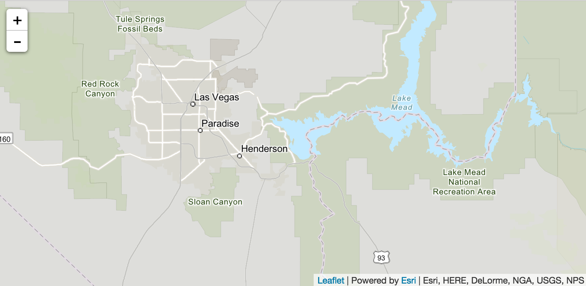

# Esri Leaflet Vector Tile Plugin

[![npm version][npm-img]][npm-url]
[](https://raw.githubusercontent.com/Esri/esri-leaflet-vector/master/LICENSE)

[npm-img]: https://img.shields.io/npm/v/esri-leaflet-vector.svg?style=flat-square
[npm-url]: https://www.npmjs.com/package/esri-leaflet-vector

> An ***experimental*** plugin for Esri Leaflet to visualize Vector tiles from ArcGIS Online. Built on top of [`mapbox-gl-leaflet`](https://github.com/mapbox/mapbox-gl-leaflet).

## Disclaimer

The code here is a house of cards that attempts to synchronize a [WebGLRenderingContext](https://developer.mozilla.org/en-US/docs/Web/API/WebGLRenderingContext) with a Leaflet map. 

* It doesn't support rotation 
* It can't draw more than one vector tile source at a time.
* `404`s will be encountered when zooming in past zoom level 15 in areas without much feature density. 

For production applications, the [ArcGIS API for JavaScript](https://developers.arcgis.com/javascript/latest/sample-code/layers-vectortilelayer/index.html) is a **much** more appropriate choice.

## Example

Take a look at the [live demo](http://esri.github.com/esri-leaflet/examples/vector-basemap.html).



```html
<html>
<head>
  <meta charset=utf-8 />
  <title>Esri Vector Basemap</title>
  <meta name='viewport' content='initial-scale=1,maximum-scale=1,user-scalable=no' />

  <!-- Load Leaflet from CDN -->
  <link rel="stylesheet" href="https://unpkg.com/leaflet/dist/leaflet.css"/>
  <script src="https://unpkg.com/leaflet/dist/leaflet.js"></script>

  <!-- Load Mapbox GL -->
  <link rel="stylesheet" href="https://unpkg.com/mapbox-gl@1.13.0/dist/mapbox-gl.css"/>
  <script src="https://unpkg.com/mapbox-gl@1.13.0/dist/mapbox-gl.js"></script>

  <!-- Esri Leaflet and Esri Leaflet Vector -->
  <script src="https://unpkg.com/esri-leaflet/dist/esri-leaflet.js"></script>
  <script src="https://unpkg.com/esri-leaflet-vector/dist/esri-leaflet-vector.js"></script>

  <style>
    body {margin:0;padding:0;}
    #map {position: absolute;top:0;bottom:0;right:0;left:0;}
  </style>
</head>
<body>

<div id="map"></div>

<script>
  var map = L.map('map').setView([ 40.706, -73.926], 14);
  L.esri.Vector.basemap('Newspaper').addTo(map);
</script>

</body>
</html>
```

## API Reference

### [`L.esri.Vector.basemap`](http://esri.github.io/esri-leaflet/api-reference/layers/vector-basemap.html)

### [`L.esri.Vector.layer`](http://esri.github.io/esri-leaflet/api-reference/layers/vector-layer.html)

### Development Instructions

1. [Fork and clone this repo](https://help.github.com/articles/fork-a-repo)
2. `cd` into the `esri-leaflet-vector` folder
3. Install the dependencies with `npm install`
4. run `npm run build` to compile the raw source inside a newly created `dist` folder.
5. run `npm test` from the command line to execute tests
6. Open `debug/sample.html` to see local changes in action.
6. Create a [pull request](https://help.github.com/articles/creating-a-pull-request) if you'd like to share your work.

## Dependencies

* Leaflet version [1.0.x](https://github.com/Leaflet/Leaflet/releases/tag/v1.0.1)
* Esri Leaflet [2.0.3](https://github.com/Esri/esri-leaflet/releases/tag/v2.0.3) (or higher) is required.
* [Mapbox GL Leaflet](https://github.com/jgravois/mapbox-gl-leaflet.git#indexed-vector-sources)
* [mapbox-gl-js](https://www.mapbox.com/mapbox-gl-js/)

## Resources

* [ArcGIS for Developers](http://developers.arcgis.com)
* [ArcGIS REST Services](http://resources.arcgis.com/en/help/arcgis-rest-api/)
* [@Esri](http://twitter.com/esri)
* [@EsriPDX](http://twitter.com/esripdx)

## Issues

Find a bug or want to request a new feature?  Please let us know by submitting an [issue](https://github.com/Esri/esri-leaflet-vector/issues).

Please take a look at previous issues on [Esri Leaflet](https://github.com/Esri/esri-leaflet-vector/issues?labels=FAQ&milestone=&page=1&state=closed) and Esri Leaflet [Vector](https://github.com/Esri/esri-leaflet-vector/issues) that resolve common problems.

You can also post issues on the [GIS Stack Exchange](http://gis.stackexchange.com/questions/ask?tags=esri-leaflet,leaflet) an/or the [Esri Leaflet place](https://geonet.esri.com/discussion/create.jspa?sr=pmenu&containerID=1841&containerType=700&tags=esri-leaflet,leaflet) on GeoNet.

## Contributing

Esri welcomes contributions from anyone and everyone. Please see our [guidelines for contributing](https://github.com/Esri/esri-leaflet/blob/master/CONTRIBUTING.md).

## [Terms](https://github.com/Esri/esri-leaflet#terms)

## Licensing

Copyright &copy; 2016-2018 Esri

Licensed under the Apache License, Version 2.0 (the "License");
you may not use this file except in compliance with the License.
You may obtain a copy of the License at

> http://www.apache.org/licenses/LICENSE-2.0

Unless required by applicable law or agreed to in writing, software
distributed under the License is distributed on an "AS IS" BASIS,
WITHOUT WARRANTIES OR CONDITIONS OF ANY KIND, either express or implied.
See the License for the specific language governing permissions and
limitations under the License.

A copy of the license is available in the repository's [LICENSE](./LICENSE) file.
